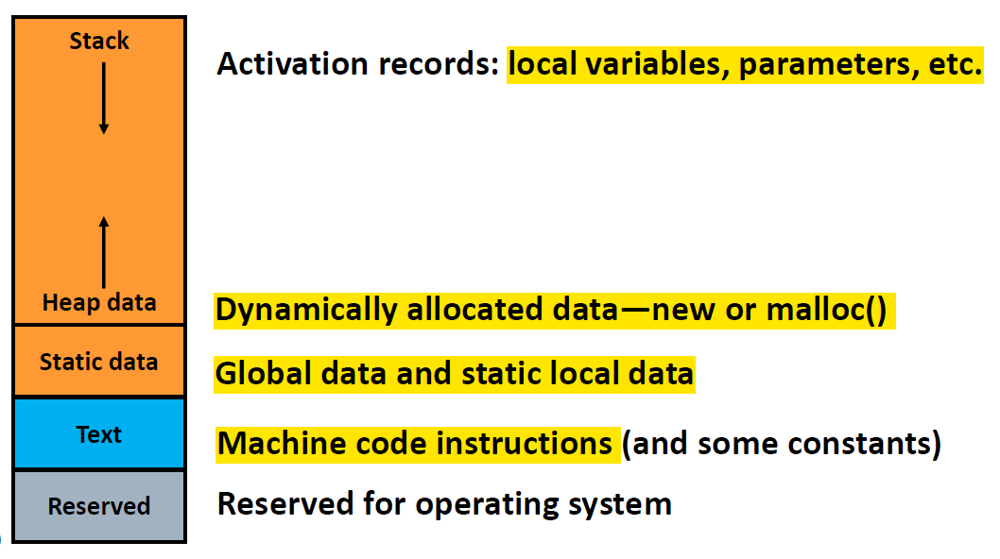
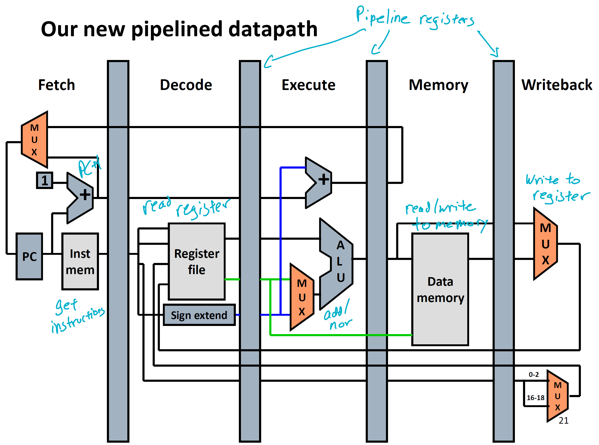
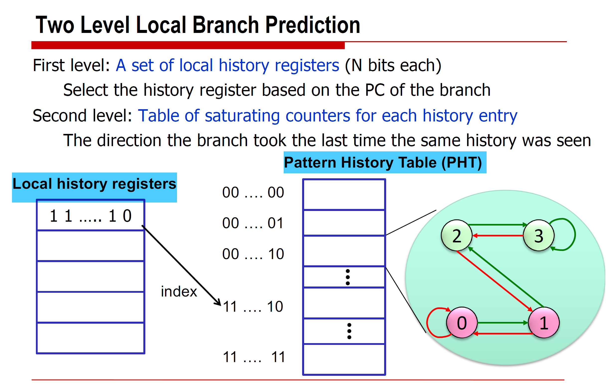

# EECS 370 - Computer Architecture

## How do computers do math?
* Two's Complement Binary Representation
    * Way of representing numbers in binary where the first bit in an n-bit number represents -2^(n-1) and all the other bits are treated normally.
    * Can represent numbers from -2^(n-1) to 2^(n-1) - 1.
    * Two's complement number can be negated by flipping all the bits and adding 1.
    * For extending a number to more bits, add all 0's in front if the number is positive, and all 1's if the number is negative.
* Floating point arithmetic
    * Represent real numbers in binary by using scientific notation. Includes the following components/bits:
        * Sign bit (0 for positive, 1 is negative).
        * Significand (23 bits) - the most significant bits after the decimal point of the number (encoded in binary).
            * Since we are working in binary, the number (if non-zero) in scientific notation will always look like 1.xxxxx... so we can ignore the leading '1'.
            * The significand takes the first 23 bits after the decimal point.
        * Exponent (8 bits) - equals the 8 bits in binary minus 127 (so exponent ranges from -127 to 128).
            * Note that the exponent represents a binary exponent. So if the exponent is 4, then we multiply the significand (with a leading 1) by 2^4 = 16. This is equivalent to shifting the decimal 4 times to the right in the binary number.
    * Zero is represented by all zero values for everything.
    * Multiplication - add the exponents (after accounting for bias of 127) and multiply the significands.
    * Addition - must align the numbers so the exponents are the same.
    * Doubles use the same format but have more bits. Max for float is 3.4\*10^38. Max for double is 1.8\*10^308.

    
## ISAs and Assembly
* Basic Architecture Concepts (Von Neumann Architecture)
    * Programs (written in C++ for example) are compiled into assembly (each command corresponds to a machine code operation, 1-1 correspondence) which are translated into machine code. The **instruction set architecture (ISA)** defines the syntax of the machine code, or the mapping of assembly instructions to machine code.
    * Von Neumann architecture - refers to the fact that data and instructions (programs) are in the same memory. Instructions are stored sequentially in memory and referenced using a program counter (PC).
        * Data can be stored in memory (RAM) and moved to registers (on CPU) which is used for doing actual operations.
    * RISC vs CISC are two designs/philosophies for encoding ISA instructions.
        * RISC (Reduced Instruction Set) - only define lowest level of instructions.
            * All instructions have same length
            * More complex instructions use multiple commands
            * Example: ARM
        * CISC (Complex Instruction Set Computer) - instructions are more complex and can have different lengths, make machine language similar to high-level language
            * Example: x86
    * Encoding assembly code to machine code
        * Each instruction is a certain number of bits, which is partitioned into the opcode (defines the operation, such as add, subtract, etc.), and the remaining bits define the source/destination registers.
        * There are special purpose registers, such as stack pointer, 0 value register, etc.
        * Note that assembly is generally not portable between different machines.

* Basic Storage Architecture Concepts
    * Data can be referenced in the following ways:
        * Immediate Values (literals) - small constant values can be placed directly in instructions, such as offset for incrementing a pointer.
        * Register Addressing - reference an address in the CPU registers (like indexing an array - only supports direct addressing).
            * Fast because register files are small and closest to CPU.
            * Architectures usually have special purpose registers, for stack pointers, status registers, program counters, etc.
        * Memory storage (RAM) - large array of storage referenced by memory addresses
            * Memory architecture - see 
            * Many addressing modes (see below)
        * Memory mapped I/O - I/O devices (keyboard, GPU, network) will look like memory to the processor/OS.
    * Addressing modes - defines how data from memory (RAM) is accessed by the CPU
        * Direct addressing - get the memory location directly. Like array indexing: M[1500].
            * Not practical because each instruction usually only have a limited number of bits (3-5) for storing locations.
            * Used for addressing locations that don't change (like global/static variables).
        * Indirect addressing - get the memory location which is stored at another memory location: M[M[1500]]
        * Register Indirect - get the memory location which is stored in a register: M[r2]
        * Base + displacement - base memory address is stored in memory, displacement is given in instruction: M[r2 + 1000]
            * Most commonly used
            * Useful for accessing class objects since we can calculate object sizes and know where each member is
        * PC-relative addressing - same as base_displacement except PC register is the base
            * Useful for branch instructions

* Instruction Set Architecture (ISA)
    * Refers to the most fundamental level of instructions able to be computed by the processor.
    * Instructions, including the type of instruction, input registers, output registers, and literal values, are encoded into a string of bits.
        * For example, ARMV8 has 32 bit instructions. But each register in ARM stores 64 bits.
        * Types of instructions in ARM include:
            * Arithmetic (add, subtract, multiply)
            * Data transfer - load and store data between memory and registers
            * Logical operators (and, or, xor, nor)
            * Branches and conditional branches (jump to different places in code)
    * Data loading
        * In ARM, each data address contains 1 byte (8 bits) of data.
        * Since each register is 64 bits (8 bytes), loading data that is smaller than this size will cause the data to be sign-extended.
        * Big vs. Little Endian - refers to the order in which bits are loaded to the register
            * Little Endian - The earlier bits (in terms of memory address) map to least significant bits in the register (reverse order in terms of memory address and reading bits left to right).
            * Big Endian - The earlier bits map to the most significant bits in the register (same order in terms of memory address).

## Translating C/C++ code to assembly

* Memory layout of variables and classes/structs
    * Modern ISA's require data to be aligned based on it's size - an N-byte variable must start at an address A, such that A%N == 0. This helps with CPU efficiency and performance.
        * Char is byte aligned, short is half-word aligned (2 bytes usually), int is word aligned (4 bytes usually)
        * So if each address is 1 byte, then Char is 1 byte, short is 2 bytes, int is 4 bytes, etc.
        * Structs are aligned based on its largest field. Size of the overall struct is a multiple of the largest field.
        * So it makes sense to put largest things first in structs.

* Function calls - how the processor manages function calls
    * Parameters are stored in registers (if they fit) and the rest are stored in memory, in the **call stack**.
    * Call Stack
        * Section of memory (RAM) used to store data for simulating function calls, including:
            * function parameters (that are not saved in registers)
            * Local variables
            * Return address and temporary storage when registers run out of space.
        * Sections of the call stack are called **stack frames**. They are allocated when functions are called, and deallocated when the function returns.
    * ARM (Linux) memory map
        * Top is dynamic data, then static data, and finally text.
            * Dynamic data - top is stack, which contains stack frames.
                * More stack frames are added downwards in the stack as functions are called.
                * Stack shrinks as functions return
                * Heap is at the bottom, where dynamically allocated data is stored (i.e. using malloc() and free())
            * Static - used for storing global variables
            * Text - used for storing instructions/code.
    * Calling Convention - How to make sure register data is consistent during function calls.
        * When a function calls another function, need to make sure that data stored in registers for the original function are still accessible if the called function rewrites those registers.
            * Solution: save the data to the stack.
        * Caller-save - Before calling a function, the higher-level function will save the registers used by its data that it will need to access after that function.
            * Downside is that it may save registers that won't be touched by the called function.
        * Callee-save - Before the function runs, it will save all the registers that it will use.
            * Downside is that it will save registers that weren't used by the higher level function.
        * In reality, both caller-save and callee-save are used. Specifically, some registers are set as caller-save registers, and some are set as callee-save. When data is stored in registers (or will be used by a function) they will be saved according to the type of register it is.
    * Stack frames
        * Each stack frame has a frame pointer, which points to the start of each stack frame.
        * Stack pointer (SP) points to next free memory address in on stack.
        * Stack frames are connected by a linked list of frame pointers

* Compilers, Linkers, and Assemblers
    * After source code (i.e. C or C++ code) is written, it is compiled, then assembled, then linked, then loaded.
    * Compiler - converts .C file to .s (assembly code) file. This can be done in parallel for each source file.
    * Assembler - converts assembly code to .o (object) file, which is in linux ELF (executable and linkable) format. Can be done in parallel for each source file.
        * Object files contain machine code instructions and other data:
            * Header - contains sizes of each of the other sections of the file.
            * Text - machine code instructions
            * Data - List of initialized global and static data, their address, and their values.
            * Symbol table - maps symbol names to values (including unresolved labels). Used by linker file to bind values to names.
            * Relocation table - identifies instructions that use addresses of variables in symbol table, so that the linker can replace the address with the new updated address after linking.
    * Linker - combines multiple object files into an executable (i.e., a.out)
        * Takes text segments and data segments and combines them.
        * Resolves references to variables (replaces addresses in relocation table).
    * Loader - used to run the executable. Loads the executable into memory and asks the OS to schedule it as a new process.
        * Creates new address space for the program and copies instructions/data to new address space.
        * Initializes registers (PC and SP)

## Executing assembly

* Pipelining in hardware
    * Each line of machine code needs to be executed by the hardware. This is done most efficiently by using pipelining.
    * Execution time (for an application) is measured by total instructions executed * clock cycles per instruction (CPI) * clock period.
    * Single cycle processor - each assembly line is 1 cycle of the processor.
        * Each cycle must go through expensive calculations (Mux, ALU, memory access, etc.) even if not needed for the instruction.
        * CPI is low (1), but clock period is high (8ns for example).
    * Multi cycle processor - each assembly line can take multiple cycles to complete, depending on the instruction.
        * Simpler instructions take less cycles than longer instructions.
        * However, the entire instruction must complete before a new instruction is started.
        * CPI is higher (4.25), and clock period is lower (2ns).
    * Multi cycle processor with pipelining - overlap execution of instructions.
        * All instructions follow similar order of cycles needed:
            * fetch instruction
            * decode instruction
            * ALU (if needed)
            * memory lookup (if needed)
            * write result to register (if needed)
        * Idea is to start processing the next instruction before the first instruction is complete.
        * Leads to low CPI (~1) while maintaining low clock period (2ns).
        * see 

* Hazards in pipelining
    * Data hazards - an instruction might alter data that is needed by an instruction that is immediately following it. Since writing the new data to register is done on the last stage, the next instruction may pick up on stale data.
        * Naive Solution: add no-ops in the assembly code to wait out data hazards. This is not practical since it increases the size of the program significantly and it's not portable to new hardware (that may have longer pipelines).
        * Solution 1: detect and stall - hardware detects for data hazards and injects no-ops into the pipelien.
        * Solution 2: detect and forward - hardware routes new data to where it is needed in following stages. This is fast but doesn't work for all instructions (like loads/stores from memory), in which case stalling is needed.
    * Control hazards - program counter does not always increase by 1. Need to handle jumps and if statements (branches).
        * Solution: branch prediction - try to predict where the program counter will go to next. If wrong, ignore the output and reload with the correct program counter. Requires the following components:
            * **Branch Target Buffer (BTB)** - store a cache mapping PC of branches to the destination address for all branches taken. So if prediction is made that branch is taken, knows which command to load.
            * Branch direction predictor - predicts whether to branch or not.
                * Always not-taken: ~30-40% accuracy
                * Always taken: ~60-70% accuracy
                * Backward taken, forward not taken: predict backward (loop) branches as taken, others not-taken ~65% accuracy
                * Last time predictor - store a bit per branch corresponding whether it was taken previously. Predict that last behaviour is same as next behaviour. (80% accuracy).
                * 2-bit saturating counter - similar to last-time predictor but only change prediction if it occurs twice in a row. (up to 90% accuracy).
                * Further optimizations:
                    * Keep track of the last N branches (either for same branch or globally across branches). This is stored as N bits in a **Global history register** or **Local history registers**. Then maintain a saturating counter for each possible value (each possible combination of the last n branches), used for predicting the next branch based on the past N branches.
                    * see 
                * Modern processors have >96% accuracy.
    * Interrupts and exceptions
        * These are handled by branching to an error function that deals with the exception.
        * For pipelined implementations, need to make sure pipeline is flushed and no commands are executed after the instruction causing the exception.

## Memory
* Cache
    * Memory stored in the processor (SRAM) is fast, but expensive. Cheap storage (like SSD, HDD) is slow. However, the processor only needs access to a small amount of memroy at one time, so to make things fast we can cache data on SRAM.
        * Use SRAM (fastest - 2ns access time or faster) for cache (ram attached to CPU).
        * Use DRAM (not as fast - 60ns access time) for main memory (ram sticks).
        * Use flash/disk (non-volatile, slow - 250ns access time for flash, 3 milliseconds for disc) as virtual memory (back things up).
    * The cache can contain data from any part of main memory. Each cache line has:
        * Tag - holds the memory address
        * Block - the memory data for that address
    * Content addressable memory
        * On the CPU, the cache is implemented as content addressable memory (CAM), which acts like a hash map and maps memory addresses to data (stored in SRAM).
    * Temporal Locality - refers to the idea that a memory location accessed once will likely be accessed again, which is why we should Cache it.
        * Leads to least recently used (LRU) eviction scheme - when cache is full, evict the item that is least recently used.
    * Spatial Locality - refers to the idea that we will likely use memory stored close to where we have previously accessed memory.
        * Block Size - instead of cacheing a single data address for each cache line, we can store a "block" of data representing a contiguous sequence of address data.
            * Also reduces number of cache keys to keep track of in CAM and size of tag, reducing overhead.
            * Most systems use block size of 32-128 bytes.
    * Dealing with writes
        * Cache hits
            * Write-through - when writing to cache and there is a hit, write to the cache and the memory.
            * Write-back - when writing to cache and there is a hit, write only to cache and set a "dirty" bit to true so that when the cache item is evicted it will know to update memory.
        * Cache miss
            * Allocate-on-write - when writing and there is a cache miss, update the value and bring it to cache.
            * No Allocate-on-write - on cache miss, write directly to memory.
    * Cache associativity
        * Fully-associative caches - a block in memory can be stored anywhere in the cache.
            * Tag searches can be expensive because need to look at every cache entry.
        * Direct-mapped caches
            * Each line in the cache only maps to a specific section of memory.
                * Makes searching if item is in cache faster, since only have to search one line.
                * But evictions are inefficient since something that is not LRU may be evicted.
        * Set associative caches
            * Hybrid between direct-mapped cache and fully associative cache.
            * Data is partitioned into sections, and each section gets some number of cache lines.
                * If each partition gets only one line, it's a direct-mapped cache.
                * If there is only one partition, it's a fully associative cache.
            * n-way set associative cache has n ways (lines) per partition.
    * Caches work with process components by interfacing with components that do memory accesses.
        * There is an instruction (I-cache) for instruction lookups in the pipeline.
        * There is a data cache for data lookups in the pipeline.

* Virtual Memory
    * Solves two main problems with memory:
        * Main memory (DRAM) is limited and there may not be enough space for all programs at once or even just a single program.
        * Each program needs to keep its memory separate from other programs.
    * Main idea:
        * Each program has its own "virtual" address space. These address spaces each map to an actual address space ("physical" address) in main memory or disk.
            * The extra memory in disk for storing stuff that doesn't fit in memory is called the **swap partition**.
        * Each program therefore doesn't have to worry about accessing other program's memory.
        * Total amount of memory available does not limit programs (as data can be stored on disk).
    * Page table
        * Each program maintains a page table which maps virtual memory addresses to addresses in DRAM or disk.
        * Page tables are stored in memory and managed by the OS, which knows the physical address of the page table for each program.
        * Each page contains a chunk of memory (for example 4KB in x86). Each virtual address is thus composed of:
            * Virtual page number (which maps to some physical page number)
            * Page offset to determine which part of the page to address, which is the same for both the physical and virtual address (but the base is different)
        * If the page is not in DRAM, it is on disk. This is called a **page fault**.
            * DRAM can be used as a cache - on a page fault we evict the lru page (or use other eviction algorithm like policy-clock) and move the new page in.
    * Multi-level page tables
        * Almost no programs will use all the virtual pages, so we won't often need all the entries in the page table itself. The page table itself can be really big, which is a problem.
        * We can further partition pages in the page table into chunks, and map these chunks from a higher, less granular page table. We then only need to create a lower-level page table for chunks that are used (therefore we save memory for the unused chunks). This is called a **Hierarchical page table**.
        * The address will include a 1st level offset (selects the 2nd level page table), 2nd level offset (selects the page in physical memory), and page offset (selects the address in physical memory).
    * Translation look-aside buffer (TLB)
        * Finding an address in a multi-level page table now requires 2 or more page table lookups in memory. This can be slow.
        * TLB is a fast cache that maps virtual pages (including all offsets except the last page offset) to physical memory.
    * Caches for disk
        * To further optimize memory, we can have a data cache between the CPU and memory.
        * Physically-addressed cache - the cache maps physical addresses to data values.
            * This is slow because the CPU needs to look up the physical address first using the TLB and page table, but it simplifies obtaining the data.
        * Virtually-addressed cache - The cache maps virtual memory addresses to data (comes before TLB and page table)
            * Faster since TLB/page table only needs to be accessed on a cache miss.
            * Requires more complexity for determining which process the virtual page belongs to.
            * Cache aliasing - when multiple virtual pages (of the same process) map to a single physical page, which causes issues with updates.
                * Only causes a problem for virtually-addressed cache.
        * Virtually indexed physically tagged (VIPT) cache
            * Data cache now contains both the data and the physical address for each virtual address key.
            * CPU accesses both TLB and the data cache in parallel, which is faster than sequentially as in physically-addressed cache.
            * The physical page from TLB and physical address from data cache are compared to prevent aliasing.
        

## Parallelism
* Greater efficiency (lower CPI) can be achieved using parallelism

* Instruction Level Parallelism (ILP) - have two or more pipelines within the same processor. (ex: superscaler pipeline)
* Thread Level Parallelism (TLP) - two or more processors (independent pipelines).
    * This only improve multiple-program performance, not single program.
* Data level parallelism (DLP) - have two or more execution pipelines (the part that does calculations and write-backs) while sharing the same fetch and control pipeline (the part that does branching and program counter) (ex: SIMD)