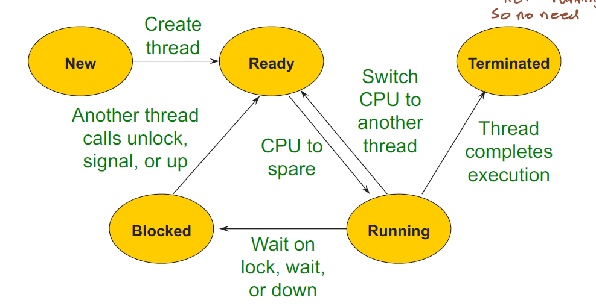

# EECS 482 - Operating Systems

## Overview
* The OS abstracts away hardware elements for processes:
    * CPU -> Threads
    * Disk -> File System
    * RAM -> Virtual Memory

## CPU and Threads
* **Process** - OS abstraction for a unit of execution (also called a job or task). Can be seen as a program in execution. (The **program** is the instructions for the process).
    * The OS manages processes so that each process has its own memory (address space) and CPU.
    * Components:
        * Process ID (PID)
        * Set of **threads** executing instructions of the program. There can be multiple threads at once.
        * **Address Space** - the memory used by the program as it runs.
    * The address space contains both data shared by threads and per-thread data:
        * code/inputs, memory, files, and network connections are shared by threads.
        * Execution stack, program counter are thread-specific state.

* Synchronization Basics
    * An operation is **Atomic** if it happens in entirety or not at all.
        * Memory load/store is atomic in most computers.
    * **Critical Section** - section of code that needs to run atomically to produce correct behavior/output.
    * **Busy-waiting** - when one thread waits for another thread to exit a critical section, and does not free up CPU in the process.
        * Locks will usually prevent busy waiting and free the CPU while waiting.
    * **Lock/mutex** - object that prevents other threads from entering a critical section:
        * lock() - wait until lock is free, then acquire it.
        * unlock() - release the lock
        * downsides - requires waiting, best to minimize critical sections. Often more efficient to have many locks for more granular things than one big lock.
    * **Condition Variables** - used when one thread needs to wait for another thread to perform some action.
        * wait(mutex) - does the following steps atomically: release the mutex, add current thread to a waiting list/queue, put the thread to sleep/idle.
        * signal() - wakes up one thread waiting on the condition variable.
        * broadcast() - wakes up all threads waiting on the condition variable.
        * Prevents busy-waiting for a condition.
        * Spurious wake-up - when a thread gets signalled but then sees that condition needed is not satisfied so has to go to sleep again.
    * **Monitor** - refers to synchornization achieved with a lock (for mutual exclusion) and condition variables (for ordering) combined together
        * Mesa monitor - threads must contend for the lock when woken up (more popular).
        * Hoare monitors - woken up monitor gets special priority and is given lock by the signalling thread.
    * Preventing deadlock
        * Deadlock occurs when there are limited resources and some threads hold resources while waiting to obtain others, and there is a cylical chain of requests.
        * Can be avoided by having a total ordering of all resources, and make sure all threads try to obtain resources based on the ordering.
        * See dining philosophers.

* Synchronization Advanced
    * Reader-writer locks
        * Multiple threads should be able to read at the same time.
        * Multiple readers can access critical region, but when there is a writer only one (reader or writer) should be able to access.
        * Can be implemented with two CV's (each with a lock), one for readers and one for writers.
    * Semaphores
        * Generalized version of mutex. Contains a non-negative integer, with two operations:
            * down/wait - atomically decrements the integer. If it is zero, then sleep/wait until signalled (similar to lock or CV).
            * up/release - atomically increases the integer by one. Signals the other threads that are waiting.
        * Mutex semaphore - integer can only be set as 1 or 0, up() automatically sets to 1. Same functionality as a mutex.
        * Counting semaphore - integer is non-negative, used for representing a resource with many units like producer-consumer or reader-writer locks.
        * Note that a semaphore isn't tied to a specific thread - any thread can call up/down on the semaphore (useful for shared resource like reader lock).
        * Locks and CV's are usually interchangeable with semaphores (with slightly different implementations). For examples, see slides 6.
    
* Concurrency Implementation
    * Threads
        * Each thread transitions from several states based on their status and whether they are waiting. The states are new, ready, running, blocked, and terminated. The "ready" state is needed since the numnber of threads might exceed the number of CPU's.
        * 
            * New - thread was just created.
            * Ready - thread is ready to run and waiting for CPU to be free (TCB is on a "ready queue").
            * Running - thread is running on the CPU.
            * Blocked - thread is waiting on a lock or CV, the TCB is on the queue for the lock/CV.
            * Terminated - thread is done running.
        * When thread is not running, its "context" is stored in memory in a **Thread Control Block (TCB)**. This includes registers, stack pointer, program counter, etc.
        * Context switch - when a thread returns control to OS and OS chooses a new thread to run.
            * Occurs on internal events - wait() or lock(), IO requests.
                * Yield - thread relinquishes CPU and gets put on end of run queue.
                * Join - thread waits for another thread to finish first. The current thread x will wait for thread y to finish by calling y.join().
            * External events - timer and interrupts switch control to OS interrupt handler.
                * Interrupts can be disabled when running OS code (intterupts should never be disabled when running user code since there could be infinite loops and such).
                    * Usually done for atomic operations, such as locks adn CV's.
            * OS will choose a new thread to run from the ready queue, or wait for next timer interrupt if there are none ready.
            * OS will save the TCB of the current running thread (done through assembly, or can use linux swapcontext()).
            * OS will load the TCB of the new thread and resume execution.
        * Creating new threads
            * Involves creating a new TCB which includes stack and other variables, then putting the TCB onto the ready queue.

* Job/task scheduling:
    * Many policies for scheduling which tasks to run first.
    * First come first serve.
    * Round robin - each task gets allocated some amount of time to run then switches.
    * Shortest time to completion.
    * Priority queue - each task gets a priority. To prevent starvation, the priority goes up if a task has been waiting a long time.
    * Proportional share - a proportion of the CPU goes to real-time tasks, such as audio playback.

## Memory

* Memory Overview
    * **Address Space** - the memory space used by a single process (includes heap, stack, code, etc.)
    * **Hardware interface** - the physical memory shared by all processes.
    * Abstractions provided by OS:
        * Virtual memory - address space for each process can be larger than physical memory.
        * Address independence - Each address space has the same addresses.
        * Protection - one process can't access data in another process's address space.

    * Historic memory architectures:
        * Uni-programming - only one process can be run at a time and uses all the memory.
        * Static address translation - each process is assigned a contiguous chunk of memory and the process is responsible for keeping track of where the chunk is in physical memory.

* Dynamic address translation and virtual addresses
    * Each process gets its own address space and memory references are translated to physical addresses by the OS using hardware (MMU)
    * Translation is done by **Memory Management Unit (MMU)** which accesses the TLB.
    * Implementations of virtual memory:
        * Base and bounds - each virtual address space is mapped to a contiguous part of physical memory.
            * Disadvantages - hard to grow address space (need to copy everything), virtual address can't be larger than physical address, causes fragmentation of physical memory due to small processes, if heap grows then all the offsets for everything above the heap (like the stack) need to change.
        * Segmentation - divides address space into segments (i.e. code segment, heap segment, etc.) and each segment is a contiguous portion of physical memory.
            * Allows for easy sharing of code segments (like code itself can be shared) and each segment can grow independently.
            * Disadvantages - each segment is limited by the size of physical memory, external fragmentation.

        * Paging - divide virtual memory into fixed-size pages, each mapping to the same size page in physical memory. Pages are kept track of using a page table.
            * Pages that don't exist in physical memory can be mapped out to disk.
            * Each page can have different protections (like read-only)
            * See 370 notes for more details

* Kernel address space
    * As described above, there is a page table per process, managed by the OS. The current page table is stored in the page table base register (PTBR) by the OS.
    * Page tables can be stored in both physical memory.
    * Can also be kept in the OS kernel's virtual address space.
        * Benefit is that page tables can be paged out to disk, but the kernel's own page table must be kept in physical memory.
    * Kernel may sometimes need to directly access locations in physical memory (like code for swapping out pages and the kernel's own page table needs to be stored in physical memory always). To achieve this, the kernel is able to bypass the MMU.
        * Usually a portion of the kernel's virtual address space is mapped directly to physical memory.
    * Kernel may sometimes need to access a user's virtual memory (i.e., for reading a file).
        * To do this, the kernel's virtual address space is mapped into every process's address space. So each process's page table will have a section for the process, and a section for the OS.
            * Problem is that the kernel's page table needs to be replicated to each process's page table. Overhead for this is usually low.
            * This allows all physical memory mapping to be managed by MMU which is fast since it's hardware.
        * To prevent processes from accessing kernel data, keep a "mode bit" so that only the OS code can read the kernel address space portion of the process page table.
            * This is safe because the OS code is already written and pre-defined, so we know it's safe.
            * Allows easy switching between process and kernel code (like when cin is called).
    * Creating an address space when a process is created.
        * Process control block (similar to TLB) is created. 
        * Page tables are initialized and execution code is copied over into memory.
        * Registers are initialized.
        * Mode is set to "user" and program starts.

* Multiprocessing
    * Thrashing - when a lot of programs actively used all of their address space, causing a lot of page faults and significantly reducing speed.
        * Can be prevented by increasing RAM or running fewer tasks for longer times.
        * Thrashing can be measured by the **working set** - all pages used in the last T seconds and seeing if it fits into memory.
    * Linux cloning with Fork
        * When a process is forked (replicated), the page table is copied over, but the actual data is not copied over in memory.
        * The OS maintains a reference count for each page in memory. When there is a write with a page with refcount > 1, then a new copy of that page is created.
            * This is called **copy-on-write** and it reduces work when forking processes.

## Network

* Network Abstraction
    * Each computer only has one network interface card (NIC). The OS abstracts the network into **Sockets**, which is a virtual NIC (communication endpoint) used by each process.
        * Sockets are specified by port number.
        * Sockets manage when and how much data to send/receive. It sends the data to the NIC, which contacts other NIC's in the network. When receiving data, the socket receives data from the NIC (distribution done by OS).
    * TCP - abstracts away network issues and makes it seem like packets are sent and received in the correct order.
        * Receiver is able to re-order packets even though they receive it in an arbitrary order.
        * If messages are dropped the sender will re-send until it gets an ack.
        * Can send messages of arbitrary size (gets broken down into fragments and streamed).
        * Large overhead for processing

## File Systems and Storage

* File Systems
    * The OS provides an abstraction to files (disk) represented as a large set of files with rich naming convention, with the same hierarchical interface irrespective of hardware.
        * Many different types of storage, specific implementation is abstracted away by device drivers.
    * File representation
        * File metadata - file size, owner and permissions, time of last access, etc. Stored in the file header, called the **inode**.
        * Pointer to data - store an array of logical block numbers (also in inode)
            * Hard drives are partitioned into units of data called "logical blocks", which can be indexed by logical block number (similar to pages in memory).
            * Makes it easy to grow file and for random access within the file.
            * To speed up sequential access of the file, make file blocks map to disk blocks close to each other.
    * Indexed files
        * Each file header stores an array of block pointers, mapping file block indexes (array indices) to disk blocks (similar to a page table).
        * To save file header memory for small files, can use multi-level file indexing (similar to multi-level page table).
            * The key would then be a range of file blocks, mapping to the logical block containing the next level file index table.
            * To further optimize and reduce the number of seeks (looking up the file index) for small files, and make all block entries fit in one header for large files, can make the secondary indices have different depths (so smaller files won't require as many seeks).
    * File names
        * Files are usually named in a hierarchical manner. I.e. "/home/user/desktop".
        * File systems are represented via a tree data structure. Each inode for a directory points to the data location, and the data contains a map from file/directory names to inode locations.
            * Modern systems use b-tree or hash map.
        * Directories and other devices can be treated the same way. A directory name will point to the header file for the directory, and a device name will point to the header for that device (i.e. another hard drive or shared network drive).
            * The data for the directory will just contain the contents of the directory (names of the files it contains).
    * File cache
        * Caches actual data contained in a logical block. Maps device name and logical block number to data. Stored in RAM.
        * RAM used for file cache is separate from virtual memory.
    * File transactions
        * Need to maintain ACID (atomicity and durability) of file system in case of failures.
        * Done by **shadowing** - during a transaction, a copy of the data is created and the changes are made there. When all the changes are done, the inode pointer is modified to point to the new copy instead of the old copy.
            * Preserves data integrity if transaction fails.
        * Can also use append-only log and commit records to keep track of which changes have been made.
            * If system crashes, re-do all the changes before the latest commit.
 