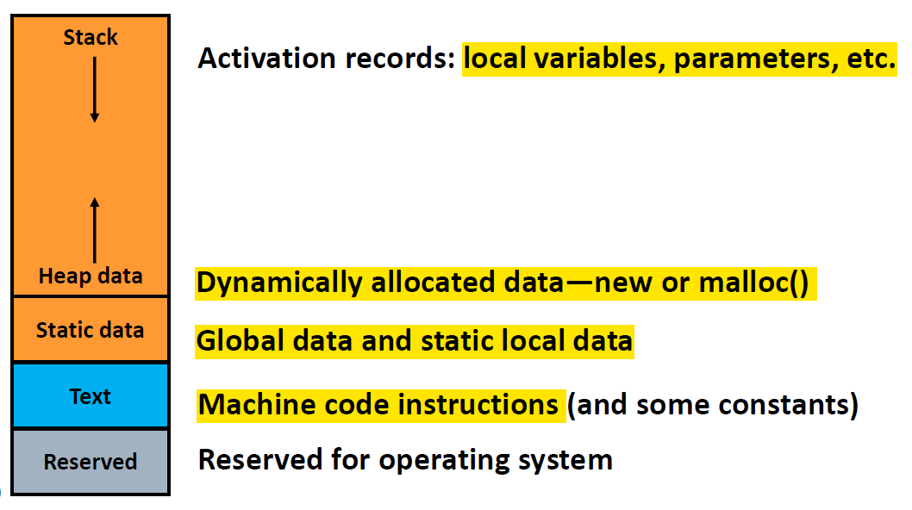

# Coures Notes from Systems Classes

## EECS 370 - Computer Architecture

### Important Concepts
* Two's Complement Binary Representation
    * Way of representing numbers in binary where the first bit in an n-bit number represents -2^(n-1) and all the other bits are treated normally.
    * Can represent numbers from -2^(n-1) to 2^(n-1) - 1.
    * Two's complement number can be negated by flipping all the bits and adding 1.
    * For extending a number to more bits, add all 0's in front if the number is positive, and all 1's if the number is negative.
    * 

    
### ISAs and Assembly
* Basic Architecture Concepts (Von Neumann Architecture)
    * Programs (written in C++ for example) are compiled into assembly (each command corresponds to a machine code operation, 1-1 correspondence) which are translated into machine code
    * Data and instructions (code) are both stored in memory
        * Instructions stored sequentially
        * Program Counter (PC) points to where in instructions
        * Data can be stored in memory (RAM) and moved to registers (on CPU) which is used for doing actual operations.
    * RISC vs CISC - define machine language operations
        * RISC (Reduced Instruction Set) - lowest level of instructions (i.e., the base ISA) is simple, all instructions same length
        * CISC (Complex Instruction Set Computer) - instructions are more complex and can have different lengths, make machine language similar to high-level language
    * Encoding assembly
        * Each instruction is a certain number of bits, which is partitioned into the opcode (defines the operation, such as add, subtract, etc.), and the remaining bits define the input/destination registers.
        * There are special purpose registers, such as stack pointer, 0 value register, etc.
    * Memory architecture - see 

* Instruction Set Architecture (ISA)
    * 

* Addressing modes - defines how memory is accessed by the CPU
    * Direct addressing - get the memory location directly. Like array indexing: M[1500].
        * Not useful because each instruction usually only have a limited number of bits (3-5) for storing locations.
    * Indirect addressing - get the memory location which is stored at another memory location: M[M[1500]]
    * Register Indirect - get the memory location which is stored in a register
    * Base + displacement - base memory address is stored in memory, displacement is given in instruction
        * Useful for accessing class objects since we can calculate object sizes and know where each member is
    * PC-relative addressing - same as base_displacement except PC register is the base

    
### Processor Implementation

### Memory

### Hot Topics
## EECS 482 - Operating Systems

## EECS 491 - Distributed Systems